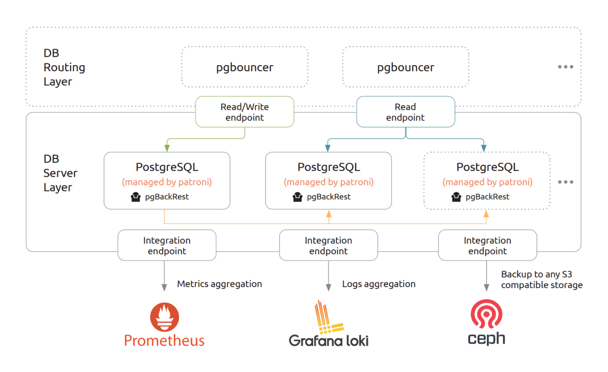

# Architecture

[PostgreSQL](https://www.postgresql.org/) is one of the most popular open source database. The “[Charmed PostgreSQL](https://charmhub.io/postgresql)” is a Juju-based operator to deploy and support PostgreSQL from [day 0 to day 2](https://codilime.com/blog/day-0-day-1-day-2-the-software-lifecycle-in-the-cloud-age/), it is based on the [PostgreSQL Community Edition](https://www.postgresql.org/community/) using the [Patroni](https://github.com/zalando/patroni) to manage PostgreSQL cluster based on [PostgreSQL synchronous replication](https://patroni.readthedocs.io/en/latest/replication_modes.html#postgresql-synchronous-replication).



<a name="hld"></a>
## HLD (High Level Design)

The charm design leverages on the SNAP “[charmed-postgresql](https://snapcraft.io/charmed-postgresql)” which is deployed by Juju on the specified VM/MAAS/bare-metal machine based on Ubuntu Jammy/22.04. SNAP allows to run PostgreSQL service(s) in a secure and isolated environment ([strict confinement](https://ubuntu.com/blog/demystifying-snap-confinement)). The installed SNAP:
```text
> juju ssh postgresql/0 snap list charmed-postgresql
Name                Version  Rev  Tracking       Publisher        Notes
charmed-postgresql  14.9     70   latest/stable  dataplatformbot  held
```

The SNAP ships the following components:

* PostgreSQL (based on Ubuntu APT package "[postgresql](https://packages.ubuntu.com/jammy/postgresql)") 
* PgBouncer  (based on Canonical [backport](https://launchpad.net/~data-platform/+archive/ubuntu/pgbouncer))
* Patroni (based on Canonical [backport](https://launchpad.net/~data-platform/+archive/ubuntu/patroni))
* pgBackRest (based on Canonical  [backport](https://launchpad.net/~data-platform/+archive/ubuntu/pgbackrest))
* Prometheus PostgreSQL Exporter (based on Canonical [backport](https://launchpad.net/~data-platform/+archive/ubuntu/postgres-exporter))
* Prometheus PgBouncer Exporter (based on Canonical [backport](https://launchpad.net/~data-platform/+archive/ubuntu/pgbouncer-exporter))
* Prometheus Grafana dashboards and Loki alert rules are part of the charm revision (and missing in SNAP).

Versions of all the components above are carefully chosen to fit functionality of each other.

The Charmed PostgreSQL unit consisting of a several services which are enabled/activated accordingly to the setup: 

```text
> juju ssh postgresql/0 snap services charmed-postgresql
Service                                          Startup   Current  Notes
charmed-postgresql.patroni                       enabled   active   -
charmed-postgresql.pgbackrest-service            enabled   active   -
charmed-postgresql.prometheus-postgres-exporter  enabled   active   -

```

The `patroni` snap service is a main PostgreSQL instance which is normally up and running right after the charm deployment.

The `pgbackrest` snap service is a backup framework for PostgreSQL. It is disabled if [Backup](/how-to/back-up-and-restore/create-a-backup) is not configured.

The `prometheus-postgres-exporter` service is activated after the relation with [COS Monitoring](/how-to/monitoring-cos/enable-monitoring) only.

```{caution}
It is possible to start/stop/restart snap services manually, but it is **not** recommended in order to avoid a split brain with a charm state machine.
```

The snap "charmed-postgresql" also ships list of tools used by charm:
* `charmed-postgresql.psql` (alias `psq`) - is PostgreSQL interactive terminal.
* `charmed-postgresql.patronictl` - a tool to monitor and manage Patroni.
* `charmed-postgresql.pgbackrest` - a tool to backup/restore PostgreSQL DB.

```{warning}
All snap resources must be executed under the special snap user `_daemon_` only!
```

<a name="integrations"></a>
## Integrations

### PgBouncer

[PgBouncer](http://www.pgbouncer.org/) is a lightweight connection pooler for PostgreSQL that provides transparent routing between your application and back-end PostgreSQL Servers. The "[PgBouncer](https://charmhub.io/pgbouncer)" is an independent charm "Charmed PostgreSQL" can be related with.

### TLS certificates operator

The [TLS Certificates](https://charmhub.io/tls-certificates-operator) charm is responsible for distributing certificates through relationship. Certificates are provided by the operator through Juju configs. For the playground deployments, the [self-signed operator](https://charmhub.io/self-signed-certificates) is available as well.

### S3 integrator

[S3 Integrator](https://charmhub.io/s3-integrator) is an integrator charm for providing S3 credentials to Charmed PostgreSQL which seek to access shared S3 data. Store the credentials centrally in the integrator charm and relate consumer charms as needed.

### Data integrator

[Data Integrator](https://charmhub.io/data-integrator) charm is a solution to request DB credentials for non-native Juju applications. Not all applications implement a data_interfaces relation but allow setting credentials via config. Also, some of the applications are run outside of juju. This integrator charm allows receiving credentials which can be passed into application config directly without implementing juju-native relation.

### PostgreSQL test app

The charm "[PostgreSQL Test App](https://charmhub.io/postgresql-test-app)" is a Canonical test application to validate the charm installation / functionality and perform the basic performance tests.

### GLAuth

GLAuth is a secure, easy-to-use and open-sourced LDAP server which provides capabilities to centrally manage accounts across infrastructures. The charm is only available for Kubernetes clouds, under the [GLAuth-K8s operator](https://charmhub.io/glauth-k8s) page, so a cross-controller relation is needed in order to integrate both charms.

### Grafana

Grafana is an open-source visualization tools that allows to query, visualize, alert on, and visualize metrics from mixed datasources in configurable dashboards for observability. This charms is shipped with its own Grafana dashboard and supports integration with the [Grafana Operator](https://charmhub.io/grafana-k8s) to simplify observability. Please follow [COS Monitoring](/how-to/monitoring-cos/enable-monitoring) setup.

### Loki

Loki is an open-source fully-featured logging system. This charms is shipped with support for the [Loki Operator](https://charmhub.io/loki-k8s) to collect the generated logs. Please follow [COS Monitoring](/how-to/monitoring-cos/enable-monitoring) setup.

### Prometheus

Prometheus is an open-source systems monitoring and alerting toolkit with a dimensional data model, flexible query language, efficient time series database and modern alerting approach. This charm is shipped with a Prometheus exporters, alerts and support for integrating with the [Prometheus Operator](https://charmhub.io/prometheus-k8s) to automatically scrape the targets. Please follow [COS Monitoring](/how-to/monitoring-cos/enable-monitoring) setup.

## LLD (Low Level Design)

Please check the charm state machines displayed in the [workflow diagrams](https://canonical-charmed-postgresql-k8s.readthedocs-hosted.com/14/explanation/flowcharts/). The low-level logic is mostly common for both VM and K8s charms.

<!--- TODO: Describe all possible installations? Cross-model/controller? --->

### Juju events

Accordingly to the [Juju SDK](https://juju.is/docs/sdk/event): “an event is a data structure that encapsulates part of the execution context of a charm”.

For this charm, the following events are observed:

1. [`on_install`](https://juju.is/docs/sdk/install-event): install the snap "charmed-postgresql" and perform basic preparations to bootstrap the cluster on the first leader (or join the already configured cluster). 
2. [`leader-elected`](https://juju.is/docs/sdk/leader-elected-event): generate all the secrets to bootstrap the cluster.
3. [`leader-settings-changed`](https://juju.is/docs/sdk/leader-settings-changed-event): Handle the leader settings changed event.
4. [`start`](https://juju.is/docs/sdk/start-event): Init/setting up the cluster node.
5. [`config_changed`](https://juju.is/docs/sdk/config-changed-event): usually fired in response to a configuration change using the GUI or CLI. Create and set default cluster and cluster-set names in the peer relation databag (on the leader only).
6. [`update-status`](https://juju.is/docs/sdk/update-status-event): Takes care of workload health checks.
<!--- 7. database_storage_detaching: TODO: ops? event?
8. TODO: any other events?
--->

### Charm code overview

[`src/charm.py`](https://github.com/canonical/postgresql-operator/blob/main/src/charm.py) is the default entry point for a charm and has the `PostgresqlOperatorCharm` Python class which inherits from CharmBase.

CharmBase is the base class from which all Charms are formed, defined by [Ops](https://juju.is/docs/sdk/ops) (Python framework for developing charms). See more information in [Charm](https://juju.is/docs/sdk/constructs#charm).

The `__init__` method guarantees that the charm observes all events relevant to its operation and handles them.

The VM and K8s charm flavors shares the codebase via [charm libraries](https://juju.is/docs/sdk/libraries) in [lib/charms/postgresql_k8s/v0/](https://github.com/canonical/postgresql-k8s-operator/blob/main/lib/charms/postgresql_k8s/v0/postgresql.py) (of K8s flavor of the charm!):
```text
> charmcraft list-lib postgresql-k8s                                                                                                                                                                                                               
Library name    API    Patch                                                                                                                                                                                                                          
postgresql      0      12                                                                                                                                                                                                                             
postgresql_tls  0      7                                  
```

