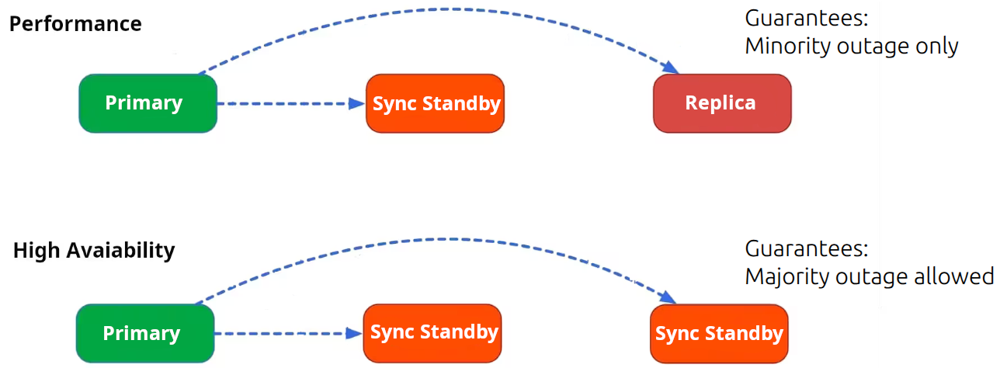

# PostgreSQL units

Each [high-availability](https://en.wikipedia.org/wiki/High_availability)/[disaster-recovery](https://en.wikipedia.org/wiki/IT_disaster_recovery) implementation has primary and secondary (standby) sites.

A Charmed PostgreSQL cluster size can be [easily scaled](/how-to/scale-replicas) from 0 to 10 units. [Contact us](/reference/contacts) if you have a cluster with 10+ units.

It is recommended to use 3+ units cluster size in production (due to [Raft consensus](https://en.wikipedia.org/wiki/Raft_(algorithm)) requirements). Those units type can be:
  * **Primary**: unit which accepts all writes and guarantees no [split-brain scenario](https://en.wikipedia.org/wiki/Split-brain_(computing)).
  * **Sync Standby** (synchronous copy) : designed for the fast automatic failover. Used for read-only queries and guaranties the latest transaction availability.
  * **Replica** (asynchronous copy): designed for long-running and resource consuming queries without affecting Primary performance. Used for read-only queries without guaranties of the latest transaction availability.



All SQL transactions have to be confirmed by all Sync Standby unit(s) before Primary unit commit transaction to the client. Therefore, high-performance and high-availability is a trade-off between "sync standby" and "replica" unit count in the cluster.

Starting from revision 561, all Charmed PostgreSQL units are configured as Sync Standby members by default. It provides better guarantees for the data survival when two of three units gone simultaneously. Users can re-configure the necessary synchronous units count using Juju config option '[synchronous-node-count](https://charmhub.io/postgresql/configurations?channel=16/stable)'.

## Primary

The simplest way to find the Primary unit is to run `juju status`. Please be aware that the information here can be outdated as it is being updated only on [Juju event 'update-status'](https://documentation.ubuntu.com/juju/3.6/reference/hook/#update-status):

```text
ubuntu@juju360:~$ juju status postgresql

Model       Controller  Cloud/Region         Version  SLA          Timestamp
postgresql  lxd         localhost/localhost  3.6.5    unsupported  13:04:15+02:00

App         Version  Status  Scale  Charm       Channel    Rev  Exposed  Message
postgresql  16.9     active      3  postgresql  16/stable  843  no       

Unit           Workload  Agent  Machine  Public address  Ports     Message
postgresql/0*  active    idle   0        10.189.210.53   5432/tcp  Primary <<<<<<<<<<<<<<
postgresql/1   active    idle   1        10.189.210.166  5432/tcp  
postgresql/2   active    idle   2        10.189.210.188  5432/tcp  

Machine  State    Address         Inst id        Base          AZ  Message
0        started  10.189.210.53   juju-422c1a-0  ubuntu@22.04      Running
1        started  10.189.210.166  juju-422c1a-1  ubuntu@22.04      Running
2        started  10.189.210.188  juju-422c1a-2  ubuntu@22.04      Running
```

The up-to-date Primary unit number can be received using Juju action `get-primary`:

```text
> juju run postgresql/leader get-primary
...
primary: postgresql/0
```

Also it is possible to retrieve this information using [patronictl](/reference/troubleshooting/cli-helpers) and [Patroni REST API](/reference/troubleshooting/cli-helpers).

## Standby / Replica

At the moment it is possible to retrieve this information using [patronictl](/reference/troubleshooting/cli-helpers) and [Patroni REST API](/reference/troubleshooting/cli-helpers) only (check the linked documentation for access details).

Example:

```text
> ... patronictl ... list
+ Cluster: postgresql (7499430436963402504) ---+-----------+----+-----------+
| Member       | Host           | Role         | State     | TL | Lag in MB |
+--------------+----------------+--------------+-----------+----+-----------+
| postgresql-0 | 10.189.210.53  | Leader       | running   |  1 |           |
| postgresql-1 | 10.189.210.166 | Sync Standby | streaming |  1 |         0 |
| postgresql-2 | 10.189.210.188 | Replica      | streaming |  1 |         0 |
+--------------+----------------+--------------+-----------+----+-----------+
```

* `postgresql-0` is a PostgreSQL Primary unit (Patroni Leader) which accepts all writes
* `postgresql-1` is a PostgreSQL/Patroni Sync Standby unit which can be promoted as new primary using manual switchover (safe).
* `postgresql-2` is a PostgreSQL/Patroni Replica unit which can NOT be directly promoted as a new Primary using manual switchover. The automatic promotion Replica=>Sync Standby is necessary to guaranties the latest SQL transactions availability on this unit to allow further promotion as a new Primary. Otherwise the manual failover can be performed to Replica unit accepting the risks of loosing the last transactions(s) which lagged behind Primary. 

## Replica lag distance

At the moment, it is only possible to retrieve this information using [patronictl](/reference/troubleshooting/cli-helpers) and [Patroni REST API](/reference/troubleshooting/cli-helpers). Check the linked documentation for access details. 

Example:

```text
> ... patronictl ... list
+ Cluster: postgresql (7499430436963402504) ---+-----------+----+-----------+
| Member       | Host           | Role         | State     | TL | Lag in MB |
+--------------+----------------+--------------+-----------+----+-----------+
| postgresql-0 | 10.189.210.53  | Leader       | running   |  1 |           |
| ...
| postgresql-2 | 10.189.210.188 | Replica      | streaming |  1 |        42 |  <<<<<
+--------------+----------------+--------------+-----------+----+-----------+

> curl ... x.x.x.x:8008/cluster | jq
  "members": [
    {
      "name": "postgresql-0",
      "role": "leader",
      "state": "running",
      ...
    },
...
    {
      "name": "postgresql-2",
      "role": "replica",
      "state": "streaming",
      ...
      "lag": 42 <<<<<<<<<<<< Lag in MB
    }
```
