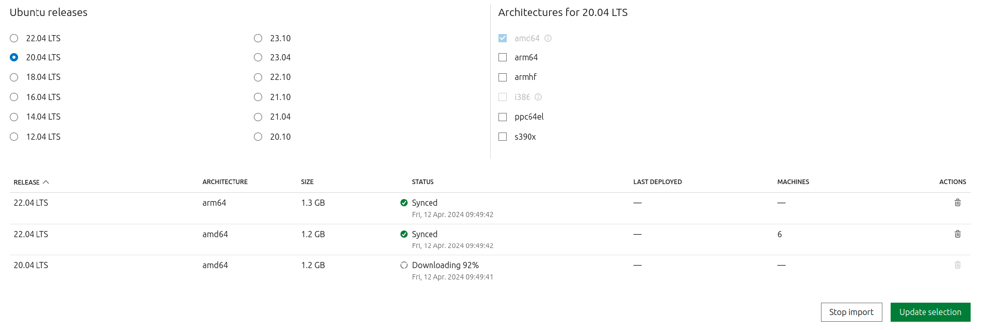
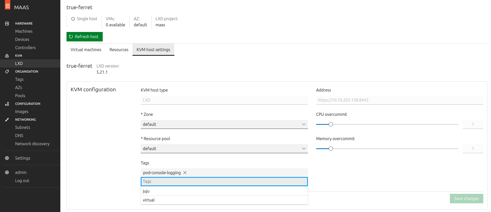
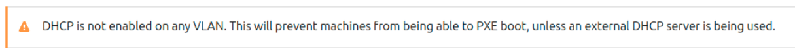

# How to deploy on MAAS

This guide aims to provide a quick start to deploying Charmed PostgreSQL on MAAS. It summarises the instructions from the [Build a MAAS and LXD environment with Multipass Tutorial](https://discourse.maas.io/t/5360) to set up and tear down a **playground environment**.

If you want to deploy PostgreSQL on MAAS in a **production environment**, refer to the official [Bootstrap MAAS Tutorial](https://maas.io/docs/tutorial-bootstrapping-maas) followed by the [Charmed PostgreSQL Tutorial](/tutorial/index).

For further details and explanation about each step, remember you can refer to the [original tutorial](https://discourse.maas.io/t/5360). 

## Bootstrap a Multipass VM

Install Multipass and launch a VM:
```text
sudo snap install multipass

wget -qO- https://raw.githubusercontent.com/canonical/maas-multipass/main/maas.yml \
 | multipass launch --name maas -c8 -m12GB -d50GB --cloud-init -
```
> The wget command provides a [cloud-init](https://github.com/canonical/maas-multipass/blob/main/maas.yml) file that will set up the LXD and MAAS environment.

## Configure MAAS

**1.** Find your MAAS IP with
```text
multipass list
```

**2.** Open `http://<MAAS_IP>:5240/MAAS/` and log in with the default credentials: username=`admin`, password=`admin`.

**3.** Complete the additional MAAS configuration in the welcome screen.


<details>
<summary><b>4.</b> Wait for image downloads to complete on <code>http://<MAAS_IP>:5240/MAAS/r/images</code> </summary>


</details>
</br>

```{note}
Make sure you are downloading 22.04 images as well (20.04 is the current default).
```

The LXD machine will be up and running after the images downloading and sync is completed.
<details>
<summary><b>5.</b> Navigate to  <code>http://<MASS_IP>:5240/MAAS/r/tags</code> and create a tag with <code>tag-name=juju</code>. Assign it to the LXD machine. </summary>


</details>

```{note}
**A note on DHCP**
MAAS uses DHCP to boot and install new machines. You must enable DHCP manually if you see this banner on MAAS pages:


**Make sure to enable DHCP service inside the MAAS VM only.**

Use the internal VM network `fabric-1` on `10.10.10.0/24` and choose a range (e.g. `10.10.10.100-10.10.10.120`). Check the [official MAAS manual](https://maas.io/docs/enabling-dhcp) for more information about enabling DHCP.
```

**6.** Finally, dump MAAS admin user API key to add as Juju credentials later:
```text
multipass exec maas -- sudo maas apikey --username admin
```

## Register MAAS with Juju

**1.** Enter the Multipass shell and install juju:
```text
multipass shell maas
sudo snap install juju
```
**2.** Add MAAS cloud and credentials into juju. 

These commands are interactive, so the following code block shows the commands followed by a sample output. **Make sure to enter your own information when prompted by juju.**
```text
juju add-cloud

> Since Juju 2 is being run for the first time, downloading latest cloud information. Fetching latest public cloud list... Your list of public clouds is up to date, see `juju clouds`. Cloud Types
>    maas
>    manual
>    openstack
>    oracle
>    vsphere
> 
> Select cloud type: maas
> Enter a name for your maas cloud: maas-cloud 
> Enter the API endpoint url: http://<MAAS_IP>:5240/MAAS
> Cloud "maas-cloud" 
```
```text
juju add-credential maas-cloud 

> ...
> Enter credential name: maas-credentials
> 
> Regions
>   default
> Select region [any region, credential is not region specific]: default
> ...
> Using auth-type "oauth1". 
> Enter maas-oauth: $(paste the MAAS Keys copied from the output above or from http://YOUR_MAAS_IP:5240/MAAS/r/account/prefs/api-keys ) 
> Credential "maas-credentials" added locally for cloud "maas-cloud".
```

**3.** Bootstrap Juju. 

Add the flags `--credential` if you registered several MAAS credentials, and `--debug` if you want to see bootstrap details:
```text
juju bootstrap --constraints tags=juju maas-cloud maas-controller
```

## Deploy Charmed PostgreSQL on MAAS
```text
juju add-model postgresql maas-cloud
juju deploy postgresql --channel 14/stable
```

Sample `juju status` output:
```text
Model       Controller       Cloud/Region        Version  SLA          Timestamp
postgresql  maas-controller  maas-cloud/default  3.1.8    unsupported  12:50:26+02:00

App         Version  Status  Scale  Charm       Channel    Rev  Exposed  Message
postgresql  14.10    active      1  postgresql  14/stable  363  no       Primary

Unit           Workload  Agent  Machine  Public address  Ports     Message
postgresql/0*  active    idle   0        10.10.10.5      5432/tcp  Primary

Machine  State    Address     Inst id        Base          AZ       Message
0        started  10.10.10.5  wanted-dassie  ubuntu@22.04  default  Deployed
```

## Test your Charmed PostgreSQL deployment

Check the [Testing](/reference/software-testing) reference to test your deployment.

## Clean up the environment

To stop your VM, run: 
```text
multipass stop maas
```
If you're done with testing and would like to free up resources on your machine, you can remove the VM entirely.

```{warning}
When you remove the VM as shown below, **you will lose all the data** in PostgreSQL and any other applications inside it! 

For more information, see the docs for [`multipass delete`](https://multipass.run/docs/delete-command).
```

To completely delete your VM and all its data, run:

```text
multipass delete --purge maas
```

If you expect having several concurrent connections frequently, it is highly recommended to deploy [PgBouncer](https://charmhub.io/pgbouncer?channel=1/stable) alongside PostgreSQL. For more information, read our explanation about [Connection pooling](/explanation/connection-pooling).


