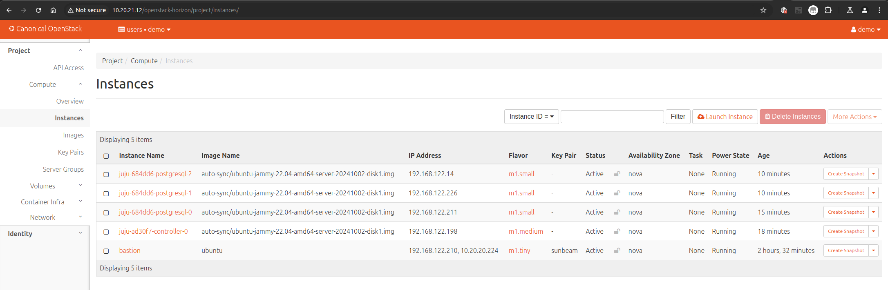

# How to deploy on Sunbeam

> **Duration** : Up to 60 minutes depending on internet download speed.

This guide goes through the steps for setting up Sunbeam and deploying Charmed PostgreSQL. 

## Prerequisites

This guide assumes you have:

* A physical or virtual machine running Ubuntu 22.04+
  * If you'd like to follow this guide in an isolated test environment, you can launch a [Multipass](https://documentation.ubuntu.com/multipass/en/latest/) instance.
* Hardware requirements depend on planned deployment size.
  * Recommended: 8 CPU cores, 32GB RAM, 100GB of storage
  * Minimum: See the requirements listed in the [Sunbeam documentation][Single-node guided]
* Juju 3 (`3.6+` is recommended)
  * See: [How to install Juju](https://documentation.ubuntu.com/juju/3.6/howto/manage-juju/#install-juju)

## Install and bootstrap Sunbeam

Follow the official OpenStack guide: [Single-node deployment][Single-node guided]. 

Pay attention to the `Caution` and `Note` sections - the `/etc/hosts` will require a [manual {spellexception}`fqdn` fix](https://github.com/canonical/multipass/issues/3277#issuecomment-2471434029).

## Enable OpenStack images auto-sync

Follow the official [Images Sync] guide to enable auto-sync and wait for the image `22.04` to be downloaded.

## Set up Juju inside an OpenStack bastion

Follow the MicroStack guide [Manage workloads with Juju] from the beginning, and stop after the section "Create a Juju controller". 

To summarise, the relevant sections are:
* Set up the bastion
* Install and configure the Juju client
* Create a Juju controller 

## Deploy Charmed PostgreSQL

Add a model if you don't have one already, and deploy a PostgreSQL cluster. Use the `-n` flag to specify number of units.
```text
juju add-model postgresql
juju deploy postgresql --channel 16/stable --base ubuntu@22.04 -n 3
```

Sample output of `juju status --watch 1s`:
```text
Model       Controller     Cloud/Region       Version  SLA          Timestamp
postgresql  my-controller  sunbeam/RegionOne  3.5.4    unsupported  19:42:44Z

App         Version  Status  Scale  Charm       Channel    Rev  Exposed  Message
postgresql  16    active      3  postgresql     16/stable    468  no       

Unit           Workload  Agent  Machine  Public address   Ports     Message
postgresql/0*  active    idle   0        192.168.122.211  5432/tcp  Primary
postgresql/1   active    idle   1        192.168.122.226  5432/tcp  
postgresql/2   active    idle   2        192.168.122.14   5432/tcp  

Machine  State    Address          Inst id                               Base          AZ    Message
0        started  192.168.122.211  3f0a331c-bc08-4bae-af22-44087a7b74d6  ubuntu@22.04  nova  ACTIVE
1        started  192.168.122.226  e6e908f8-0da1-4440-9bbd-9f1c1bc780df  ubuntu@22.04  nova  ACTIVE
2        started  192.168.122.14   6f9ad7cd-2a9d-435e-a6d8-3e39bf2218cd  ubuntu@22.04  nova  ACTIVE
```

## (Optional) Access the OpenStack dashboard

Follow the official guide: [Accessing the OpenStack dashboard].

````{note}
When using a Multipass VM, you may need to manually route OpenStack IPs. For example:
```text
sudo ip route add 10.10.10.0/24 via 10.76.203.210 
```
where `10.76.203.210` is the IP of the Multipass VM and  `10.10.10.0` is the network returned by `sunbeam dashboard-url`. 
````

The image below is an example of the OpenStack dashboard view (bastion + juju controller + 3 `postgresql` nodes):



> To learn more about deploying and operating PostgreSQL, see the [Charmed PostgreSQL tutorial][Tutorial].

<!-- LABELS-->
[Tutorial]: /tutorial/index
[Single-node guided]: https://microstack.run/docs/single-node-guided
[Accessing the OpenStack dashboard]: https://microstack.run/docs/dashboard
[Images Sync]: https://microstack.run/docs/images
[Manage workloads with Juju]: https://microstack.run/docs/juju-workloads

