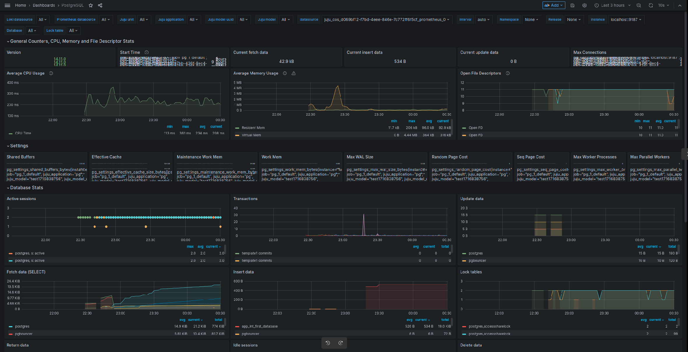

# How to enable monitoring

## Prerequisites

* Charmed PostgreSQL [Revision 336 or greater](/reference/releases)
* [`cos-lite` bundle](https://charmhub.io/topics/canonical-observability-stack/tutorials/install-microk8s) deployed in a Kubernetes environment

First, switch to the COS K8s environment and offer COS interfaces to be cross-model integrated with the Charmed PostgreSQL VM model.

To switch to the Kubernetes controller for the COS model, run

```text
juju switch <k8s_controller>:<cos_model_name>
```

To offer the COS interfaces, run

```text
juju offer grafana:grafana-dashboard grafana
juju offer loki:logging loki
juju offer prometheus:receive-remote-write prometheus
```

## Consume offers via the PostgreSQL model

Next, we will switch to the Charmed PostgreSQL VM model, find offers, and consume them.

We are currently on the Kubernetes controller for the COS model. To switch to the PostgreSQL model, run

```text
juju switch <machine_controller_name>:<postgresql_model_name>
```

To find offers, run

```text
juju find-offers <k8s_controller>:admin/<cos_model_name>
```

The output should be similar to the sample below, where `k8s` is the k8s controller name and `cos` is the model where `cos-lite` has been deployed:

```text
Store  URL                   Access Interfaces
k8s    admin/cos.grafana     admin  grafana_dashboard:grafana-dashboard
k8s    admin/cos.loki        admin  loki_push_api:logging
k8s    admin/cos.prometheus  admin  prometheus-receive-remote-write:receive-remote-write
...
```

To consume offers to be reachable in the current model, run

```text
juju consume <k8s_controller>:admin/cos.prometheus
juju consume <k8s_controller>:admin/cos.loki
juju consume <k8s_controller>:admin/cos.grafana
```

## Deploy and integrate Grafana

First, deploy the [`grafana-agent`](https://charmhub.io/grafana-agent) subordinate charm.

```text
juju deploy grafana-agent
```

Then, integrate (previously known as "relate") it with PostgreSQL 

```text
juju integrate postgresql:cos-agent grafana-agent
```

Finally, integrate `grafana-agent` with consumed COS offers:

```text
juju integrate grafana-agent grafana
juju integrate grafana-agent loki
juju integrate grafana-agent prometheus
```

After this is complete, Grafana will show the new dashboard `PostgreSQL Exporter` and will allow access to Charmed PostgreSQL logs on Loki.

Below is a sample output of `juju status` on the Charmed PostgreSQL VM model:

```text
ubuntu@localhost:~$ juju status
Model      Controller  Cloud/Region         Version  SLA          Timestamp
vmmodel    local       localhost/localhost  2.9.42   unsupported  00:12:18+02:00

SAAS           Status  Store    URL
grafana        active  k8s      admin/cos.grafana-dashboards
loki           active  k8s      admin/cos.loki-logging
prometheus     active  k8s      admin/cos.prometheus-receive-remote-write

App                   Version      Status  Scale  Charm               Channel   Rev  Exposed  Message
grafana-agent                      active      1  grafana-agent       edge        5  no
postgresql              14.7       active      1  postgresql          14/edge   296  no       Primary

Unit                          Workload  Agent  Machine  Public address  Ports               Message
postgresql/3*                 active    idle   4        10.85.186.140                       Primary
  grafana-agent/0*            active    idle            10.85.186.140

Machine  State    Address        Inst id        Series  AZ  Message
4        started  10.85.186.140  juju-fcde9e-4  jammy       Running
```

Example of `juju status` on a COS K8s model:

```text
ubuntu@localhost:~$ juju status
Model  Controller   Cloud/Region        Version  SLA          Timestamp
cos    k8s          microk8s/localhost  2.9.42   unsupported  00:15:31+02:00

App           Version  Status  Scale  Charm             Channel  Rev  Address         Exposed  Message
alertmanager  0.23.0   active      1  alertmanager-k8s  stable    47  10.152.183.206  no
catalogue              active      1  catalogue-k8s     stable    13  10.152.183.183  no
grafana       9.2.1    active      1  grafana-k8s       stable    64  10.152.183.140  no
loki          2.4.1    active      1  loki-k8s          stable    60  10.152.183.241  no
prometheus    2.33.5   active      1  prometheus-k8s    stable   103  10.152.183.240  no
traefik       2.9.6    active      1  traefik-k8s       stable   110  10.76.203.178   no

Unit             Workload  Agent  Address      Ports  Message
alertmanager/0*  active    idle   10.1.84.125
catalogue/0*     active    idle   10.1.84.127
grafana/0*       active    idle   10.1.84.83
loki/0*          active    idle   10.1.84.79
prometheus/0*    active    idle   10.1.84.96
traefik/0*       active    idle   10.1.84.119

Offer         Application  Charm           Rev  Connected  Endpoint              Interface                Role
grafana       grafana      grafana-k8s     64   1/1        grafana-dashboard     grafana_dashboard        requirer
loki          loki         loki-k8s        60   1/1        logging               loki_push_api            provider
prometheus    prometheus   prometheus-k8s  103  1/1        receive-remote-write  prometheus_remote_write  provider
```

## Connect Grafana web interface

To connect to the Grafana web interface, follow the [Browse dashboards](https://charmhub.io/topics/canonical-observability-stack/tutorials/install-microk8s) section of the MicroK8s "Getting started" guide.

```text
juju run grafana/leader get-admin-password --model <k8s_cos_controller>:<cos_model_name>
```

Below is a sample screenshot of Charmed PostgreSQL on the Grafana web UI:


