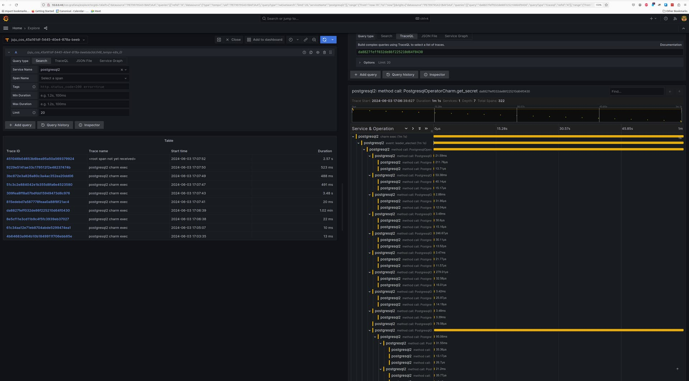

# Enable tracing

This guide contains the steps to enable tracing with [Grafana Tempo](https://grafana.com/docs/tempo/latest/) for your PostgreSQL application. 

```{caution}
This is feature is in development. It is **not recommended** for production environments. 
```

## Prerequisites

Enabling tracing with Tempo requires that you:

- Have deployed Charmed PostgreSQL revision 421+ 
  - See [](/how-to/deploy/index)
- Have deployed a `cos-lite` bundle from the `latest/edge` track in a Kubernetes environment
  - See [Getting started on MicroK8s](https://charmhub.io/topics/canonical-observability-stack/tutorials/install-microk8s)


## Deploy Tempo

First, switch to the Kubernetes controller where the COS model is deployed:

```text
juju switch <k8s_controller_name>:<cos_model_name>
```

Then, deploy the dependencies of Tempo following [this tutorial](https://discourse.charmhub.io/t/tutorial-deploy-tempo-ha-on-top-of-cos-lite/15489). In particular, we would want to:
- Deploy the MinIO charm
- Deploy the S3 integrator charm
- Add a bucket into MinIO using a python script
- Configure S3 integrator with the MinIO credentials

Finally, deploy and integrate with Tempo HA in [a monolithic setup](https://discourse.charmhub.io/t/tutorial-deploy-tempo-ha-on-top-of-cos-lite/15489#deploy-monolithic-setup).

## Offer interfaces

Next, offer interfaces for cross-model integrations from the model where Charmed PostgreSQL is deployed.

To offer the Tempo integration, run

```text
juju offer <tempo_coordinator_k8s_application_name>:tracing
```

Then, switch to the Charmed PostgreSQL model, find the offers, and integrate (relate) with them:

```text
juju switch <machine_controller_name>:<postgresql_model_name>

juju find-offers <k8s_controller_name>:
```
```{tip}
Don't miss the "`:`" in the command above.
```

Below is a sample output where `k8s` is the K8s controller name and `cos` is the model where `cos-lite` and `tempo-k8s` are deployed:

```text
Store  URL                            Access  Interfaces
k8s    admin/cos.tempo                admin   tracing:tracing
```

Next, consume this offer so that it is reachable from the current model:

```text
juju consume k8s:admin/cos.tempo
```

## Consume interfaces

First, deploy [Grafana Agent](https://charmhub.io/grafana-agent) from the `latest/edge` channel.

```text
juju deploy grafana-agent --channel latest/edge
```

Then, integrate Grafana Agent with Charmed PostgreSQL:
```text
juju integrate postgresql:cos-agent grafana-agent:cos-agent
```

Finally, integrate Grafana Agent with the consumed interface from the previous section:
```text
juju integrate grafana-agent:tracing tempo:tracing
```

Wait until the model settles. The following is an example of the `juju status --relations` on the Charmed PostgreSQL model:

```text
Model     Controller  Cloud/Region         Version  SLA          Timestamp
database  lxd         localhost/localhost  3.5.4    unsupported  21:43:34Z

SAAS        Status  Store       URL
tempo       active  uk8s        admin/cos.tempo

App            Version  Status   Scale  Charm          Channel      Rev  Exposed  Message
grafana-agent           blocked      1  grafana-agent  latest/edge  286  no       Missing ['grafana-cloud-config']|['grafana-dashboards-provider']|['logging-consumer']|['send-remote-write'] for cos-a...
postgresql     14.13    active       1  postgresql                    0  no       

Unit                Workload  Agent  Machine  Public address  Ports     Message
postgresql/0*       active    idle   0        10.205.193.87   5432/tcp  Primary
  grafana-agent/0*  blocked   idle            10.205.193.87             Missing ['grafana-cloud-config']|['grafana-dashboards-provider']|['logging-consumer']|['send-remote-write'] for cos-a...

Machine  State    Address        Inst id        Base          AZ  Message
0        started  10.205.193.87  juju-1fee5d-0  ubuntu@22.04      Running

Integration provider       Requirer                   Interface              Type         Message
grafana-agent:peers        grafana-agent:peers        grafana_agent_replica  peer         
postgresql:cos-agent       grafana-agent:cos-agent    cos_agent              subordinate  
postgresql:database-peers  postgresql:database-peers  postgresql_peers       peer         
postgresql:restart         postgresql:restart         rolling_op             peer         
postgresql:upgrade         postgresql:upgrade         upgrade                peer         
tempo:tracing              grafana-agent:tracing      tracing                regular  
```

```{note}
All traces are exported to Tempo using HTTP. Support for sending traces via HTTPS is an upcoming feature.
```

## View traces

After this is complete, the Tempo traces will be accessible from Grafana under the `Explore` section with `tempo-k8s` as the data source. You will be able to select `postgresql` as the `Service Name` under the `Search` tab to view traces belonging to Charmed PostgreSQL.

Below is a screenshot demonstrating a Charmed PostgreSQL trace:



Feel free to read through the [Tempo HA documentation](https://discourse.charmhub.io/t/charmed-tempo-ha/15531) at your leisure to explore its deployment and its integrations.

